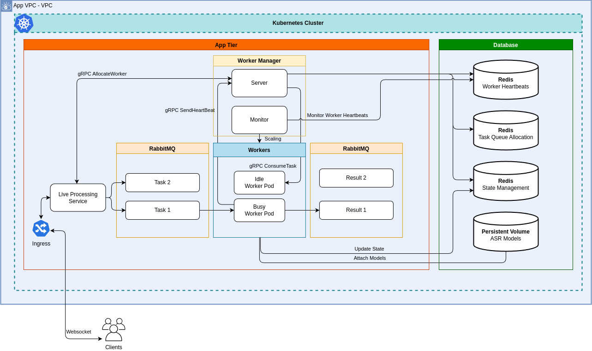
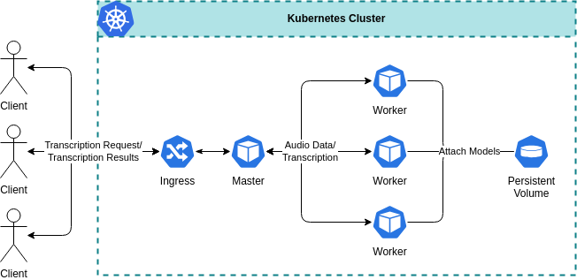

# Final Year Project: Enhancing Speech Recognition Scaling and Resilience through Decoupled Architecture

## 🔗 Project Links

- [🎥 Presentation Video](https://youtu.be/yp8j7EM0S-0)
- [📄 FYP Report](fyp_report.pdf)
- [📊 Presentation Slides](fyp_presentation_slides.pptx)

## 📘 Project Overview

This project redesigns an existing Automatic Speech Recognition (ASR) system to improve scalability, fault tolerance, and deployment flexibility. By introducing RabbitMQ as a message broker, the system is decoupled into independent services, enabling asynchronous communication between the master (live transcription) service and the worker.

Additional features such as heartbeat monitoring, external state management, dynamic autoscaling, and infrastructure-as-code deployment using Terraform on AWS were implemented to further enhance system resilience and scalability.

For more details, refer to the [FYP Report](fyp_report.pdf).

## 🧠 Background

The original ASR system provided real-time speech-to-text transcription and consisted of two tightly coupled components:

- Master pod (live transcription service)

- Worker

## ⚠️ Limitations of the Previous System

1. **Limited Scalability:** Tightly coupled design restricts scaling under increased workload.

2. **Weak Fault Tolerance:** Failures in one component can bring down the entire system.

3. **Stateful Architecture:** Maintaining state within services complicates failover and scaling.

## ✅ Proposed Improvements

1. **Decoupled Architecture:**: Introduced RabbitMQ to decouple components and enable asynchronous, message-based communication.
2. **Fault Detection via Heartbeat Monitoring:**: Implemented periodic heartbeat signals from workers to monitor health and detect crashes or disconnections.
3. **External State Management:**: Used Redis to store worker state and task metadata, allowing recovery and reassignment when failures occur.
4. **Dynamic Autoscaling:**: Autoscaling of the services using Kubernetes Horizontal Pod Autoscaler (HPA) is implemented to handle increased workloads efficiently. Implemented worker management to ensure an optimal number of idle workers is maintained based on task volume.

## 🧰 Tech Stack

- **Backend**: Python, with Tornado framework
- **Message Broker**: RabbitMQ
- **In-Memory Data Store**: Redis
- **Microservice Communication**: gRPC
- **Containerisation**: Docker, Kubernetes and Helm
- **Cloud Platform**: AWS
- **Infrastructure-as-Code**: Terraform

## 💡 Tips on How to Ace your FYP

1. **Start Early:** Begin your project as soon as possible to avoid last-minute stress.
2. **Understand the Requirements:** Clearly define the expectations for your project. Consider questions such as:
   - What problem are you solving?
   - Who are the intended users of the system?
   - How many users will the system support?
   - What are the service level agreements (SLAs) for the system, such as uptime and response time?
3. **Communicate with Your Supervisor:** Regularly update your supervisor on your progress and seek feedback. They can provide valuable insights and this serve as a form of accountability for yourself to stay on track.

## 💬 Tips for Delivering a Strong FYP Presentation

1. **Know Your Audience:** Tailor explanations to a non-expert listener (e.g., your examiner may not know Kafka or RabbitMQ).
2. **Clearly State the Problem Early:** Within the first 5 minutes, define the problem and give a high-level overview of your solution.
3. **Use Visual Architecture Diagrams:** Include animated PowerPoint diagrams to explain how services interact—this is essential for clarity.
4. **Include a Demo:** Record and present a working demo of your system to highlight that it works in practice.
5. **End With Your Contributions:** Always conclude by summarizing _what you personally contributed_. Don't end at future work—own your achievements.
6. **Rehearse with Feedback:** Record your presentation, review it, and share it with your supervisor or non-technical friends for feedback.
